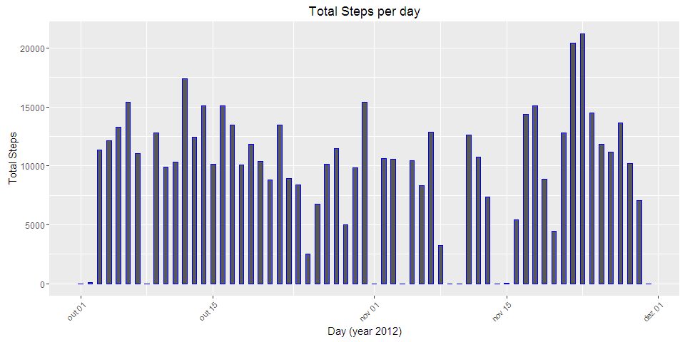
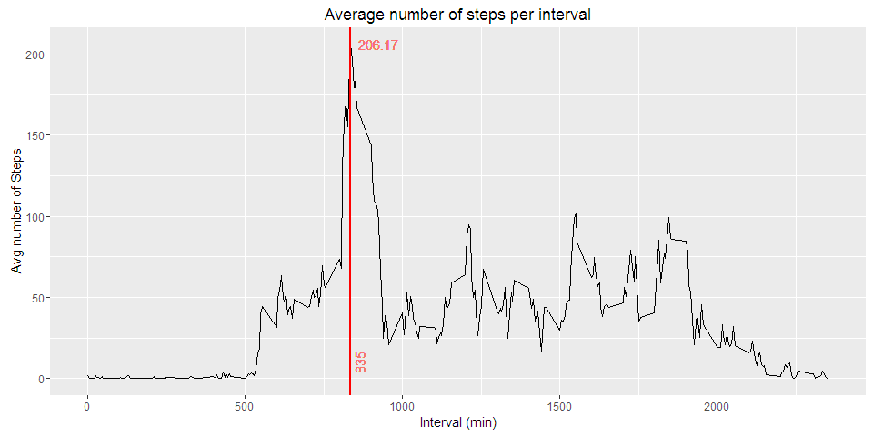
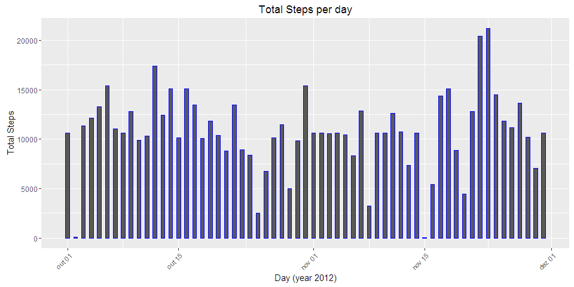
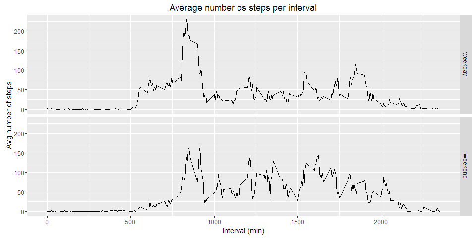

# Reproducible Research: Peer Assessment 1


## Loading and preprocessing the data

First of all two actions were made in order to start the project: 

1. loaded every required package  
2. winzip the dataset activity file  

Then I loaded the csv file and formatted the *date* variable as **date**  


```r
library(ggplot2)
```

```
## Warning: package 'ggplot2' was built under R version 3.2.5
```

```r
library(dplyr)
```

```
## Warning: package 'dplyr' was built under R version 3.2.5
```

```
## 
## Attaching package: 'dplyr'
```

```
## The following objects are masked from 'package:stats':
## 
##     filter, lag
```

```
## The following objects are masked from 'package:base':
## 
##     intersect, setdiff, setequal, union
```

```r
unzip("activity.zip")
activity <- read.csv("activity.csv")
activity$date <- as.Date(activity$date)
```


## What is mean total number of steps taken per day?

I created a dataset with Total number of steps per day.


```r
total <- aggregate(activity$steps, by = list(activity$date), FUN = sum, na.rm = TRUE)
names(total) <- c("Date", "Total_Steps")
```

The Histogram of Total number of steps for each day is like following.


```r
p <- ggplot(total, aes(x = Date, y = Total_Steps) )
p + geom_bar(stat = "identity", color = "blue", width = .5) + theme(axis.text.x = element_text(angle = 45,hjust = 1, size = 8)) + labs(title = "Total Steps per day", x = "Day (year 2012)", y = "Total Steps")
```

<!-- -->

And then I calculated the Mean and Median total number of steps


```r
TMean <- mean(total$Total_Steps)
TMedian <- median(total$Total_Steps)
TMean <- format(TMean, digits = 2, nsmall = 2)
```

Mean       |  Median
---------- | -------------
9354.23  |  10395


  
## What is the average daily activity pattern?

For this item I created another dataset with the average of steps
per interval and calculated the interval with maximum average number
of steps.


```r
Average5min <- aggregate(activity$steps, by = list(activity$interval), FUN = mean, na.rm = T)
names(Average5min) <- c("Interval", "Mean_Steps")
Max_Val_Row <- which.max(Average5min$Mean_Steps)
Peak_Interv <- Average5min[Max_Val_Row,1]
Max_Val <- format(Average5min[Max_Val_Row,2], digits = 2, nsmall = 2)
Max_Int <- Average5min[Max_Val_Row,1]
```

As we can see in the time series plot below the maximum average number of steps is **206.17** at interval **835**  


```r
p <- ggplot(Average5min, aes(x = Interval, y = Mean_Steps))
p + geom_line(position = "identity") + geom_vline(aes(xintercept = Peak_Interv), color = "red", size = 1) + geom_text(aes(x = Peak_Interv+30, y = 10, label = Max_Int, angle = 90, colour = "red"), show.legend = F) + geom_text(aes(x = Peak_Interv+90, y = as.integer(Max_Val), label = Max_Val, colour = "red"), show.legend = F) + labs(title = "Average number of steps per interval", x = "Interval (min)", y = "Avg number of Steps")
```

<!-- -->
  
  

## Imputing missing values
  
**1.** I calculated the number of missing values as follows


```r
Total_NA <- sum(is.na(activity$steps))
```
  
  So, the total number of missing values is **2304**.    

**2.** The strategy for filling the missing values is replace it with the average of the same interval. Then the new dataset was created with no NA´s.


```r
Data_NA <- activity[is.na(activity$steps),]
INterv <- unique(Data_NA$interval)
fill_NA <- filter(Average5min, Interval %in% INterv)
activity_NA <- activity %>% mutate(steps = ifelse(is.na(steps) & interval %in% fill_NA$Interval, as.integer(fill_NA$Mean_Steps), activity$steps))
```
  
**3.** Now a Histogram of Total steps per day was generated with this dataset, and new Mean and Median values were calculated.
  

```r
total_NA <- aggregate(activity_NA$steps, by = list(activity_NA$date), FUN = sum)
names(total_NA) <- c("Date", "Total_Steps")
```


```r
p <- ggplot(total, aes(x = Date, y = Total_Steps) )
p <- ggplot(total_NA, aes(x = Date, y = Total_Steps) )
p + geom_bar(stat = "identity", color = "blue", width = .5) + theme(axis.text.x = element_text(angle = 45,hjust = 1, size = 8)) + labs(title = "Total Steps per day", x = "Day (year 2012)", y = "Total Steps")
```

<!-- -->
  

```r
TMean_NA <- mean(total_NA$Total_Steps)
TMedian_NA <- median(total_NA$Total_Steps)
TMean_NA <- format(TMean_NA, digits = 2, nsmall = 2)
```


Mean       |  Median
---------- | -------------
10749.77  |  10641  


## Are there differences in activity patterns between weekdays and weekends?
  
  
I created a new factor variable indicating the *weekday* and *weekend* for each day in dataset.  
The variable **WeekE** contains the values for weekend. For Brasilian Portuguese, ***sábado*** means *saturday* and ***domingo*** means *sunday*.  


```r
WeekE <- c("sábado", "domingo")
activity_patterns <- activity_NA %>% mutate(week = ifelse(weekdays(date) %in% WeekE, "weekend", "weekday"))
```
  
Then a time series plot with a 5 min interval showed a slightly difference between weekday and weekend activities.  
  

```r
AVG_patterns <- aggregate(activity_patterns$steps, by = list(activity_patterns$week, activity_patterns$interval), FUN = mean)
names(AVG_patterns) <- c("Week", "Interval", "Mean_Steps")

qplot(Interval, Mean_Steps, data = AVG_patterns, facets =  Week ~ ., geom = "line", xlab = "Interval (min)", ylab = "Avg number of steps", main = "Average number os steps per interval")
```

<!-- -->

